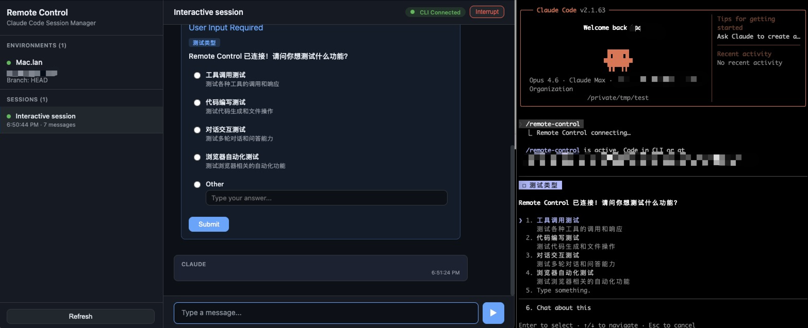

# Claude Code Remote Control Server（远程控制服务器）

一个自建的服务器，为 Claude Code CLI 会话提供**实时、双向**的 Web 交互界面。

**[English](./README.md)**



> **重要提示：** 如果你用的是 Claude 官方订阅，那么官方的 Remote Control 就已经可以用了。但如果你用的是 API，或者是 Deepseek/GLM/Kimi/Minimax on Claude Code 用户，这个项目将会有巨大作用。

## 为什么需要 Remote Control？

Claude Code 将对话历史存储为本地 JSONL 文件（`~/.claude/projects/.../`）。读取这些文件只能得到一个静态的、事后的视图。

Remote Control 模式有本质区别：

- **实时流式传输** — Claude 的回复、工具调用、推理过程在发生时就能看到，而不是事后查看。
- **双向交互** — 在 Web UI 中发送消息、批准/拒绝工具权限请求、回答 elicitation 提问。你是参与者，不是旁观者。
- **多设备访问** — 在网络中的任何设备上打开浏览器即可访问 Web UI。

## 架构

```
浏览器 (Web UI)
    ↕  WebSocket /api/ws/:sessionId
Remote Control Server（本项目）
    ↕  WebSocket /v2/session_ingress/ws/:sessionId
    ↕  HTTP POST /v2/session_ingress/session/:sessionId/events
Claude Code CLI（bridge 模式）
```

CLI 以 **bridge 模式**运行，向服务器注册为一个 "environment"。当用户通过 Web UI 创建会话时，服务器将工作分派给 CLI。CLI 启动子进程，通过 WebSocket + HTTP POST（HybridTransport）连回服务器，实时传输所有事件。

## 快速开始

### 1. 安装依赖

```bash
cd remote-control-server
npm install
```

### 2. 构建并运行

```bash
npm run build
npm start
```

或使用开发模式：

```bash
npm run dev
```

服务器默认启动在 `http://0.0.0.0:3000`。在浏览器中打开 `http://localhost:3000` 访问 Web UI。

### 3. 配置

环境变量：

| 变量 | 默认值 | 说明 |
|------|--------|------|
| `PORT`   | `3000`  | 服务器监听端口 |
| `HOST`   | `0.0.0.0` | 服务器绑定地址 |
| `DEBUG`  | （未设置） | 设为任意值启用请求日志 |

## 修补 Claude Code 以使用自建服务器

Claude Code 的 bridge 模式有两个 `BASE_API_URL` 配置：**prod** 配置指向 `https://api.anthropic.com`，**local/dev** 配置指向 `http://localhost:3000`。要将其指向自建服务器，需要修补 CLI 二进制文件。

> **注意：** CLI 二进制文件经过混淆压缩——函数名和行号每个版本都会变化。以下所有指引使用**版本无关的模式**（稳定的字符串常量 + 用 `[[:space:]]*` 处理可选空格的正则），不受 CLI 版本和压缩方式影响。

> **平台注意：** `sed -i` 语法因平台而异：Linux（GNU sed）用 `sed -i`，macOS（BSD sed）用 `sed -i ''`。文末的[一键修补脚本](#一键修补脚本)会自动处理。

### 自动检测 CLI 路径

CLI 路径随 Node.js 版本变化。使用自动检测代替硬编码路径：

```bash
CLI_JS="$(readlink -f "$(which claude)" 2>/dev/null)" \
    || CLI_JS="$(realpath "$(which claude)" 2>/dev/null)" \
    || CLI_JS="$(which claude)"
echo "CLI: $CLI_JS"
```

### 定位相关代码

使用 `grep` 搜索以下版本无关的模式来定位需要修补的代码：

```bash
# 1. 找到硬编码的 BASE_API_URL（prod 配置）
grep -n 'BASE_API_URL.*api\.anthropic\.com' "$CLI_JS"

# 2. 找到 OAuth URL 白名单
grep -n 'beacon.claude-ai.staging.ant.dev' "$CLI_JS"

# 3. 找到 HTTP 强制检查（2.1.63+）
grep -n 'Remote Control base URL uses HTTP' "$CLI_JS"

# 4. 找到 WebSocket URL 推导逻辑（v1 vs v2 路由，2.1.63+）
grep -n 'session_ingress/ws/' "$CLI_JS"

# 5. 找到 tengu_ccr_bridge feature flag
grep -n 'tengu_ccr_bridge' "$CLI_JS"
```

### 修补方法

**方案 A：直接修改硬编码 URL**

将 prod 配置中的 `https://api.anthropic.com` 替换为你的服务器地址：

```bash
# 示例：指向 192.168.1.100:3000 上的服务器
# [[:space:]]* 同时兼容压缩（无空格）和非压缩（有空格）的 JS
sed -E -i 's|BASE_API_URL:[[:space:]]*"https://api\.anthropic\.com"|BASE_API_URL:"http://192.168.1.100:3000"|' "$CLI_JS"
```

**方案 B：绕过 `CLAUDE_CODE_CUSTOM_OAUTH_URL` 的白名单**

CLI 支持 `CLAUDE_CODE_CUSTOM_OAUTH_URL` 环境变量，但会验证其是否在硬编码的白名单中。通过搜索 `beacon.claude-ai.staging.ant.dev` 找到白名单并添加你的 URL：

```bash
# 找到白名单数组（包含 "beacon.claude-ai.staging.ant.dev"）
grep -n 'beacon.claude-ai.staging.ant.dev' "$CLI_JS"

# 将你的服务器 URL 添加到白名单数组，然后设置环境变量：
sed -i 's|"https://beacon.claude-ai.staging.ant.dev"|"https://beacon.claude-ai.staging.ant.dev","https://your-server.example.com"|' "$CLI_JS"
export CLAUDE_CODE_CUSTOM_OAUTH_URL=https://your-server.example.com
```

### 重要注意事项

1. **HTTP 与 HTTPS**（2.1.63+）：CLI 强制要求非 localhost URL 使用 HTTPS（搜索 `Remote Control base URL uses HTTP`）。如果你的服务器在非 localhost 地址上使用明文 HTTP，你需要：
   - 配置带 TLS 的反向代理（推荐）
   - 或去掉 HTTP 检查：

   ```bash
   # 版本无关：匹配任意变量名，处理可选空格
   sed -E -i 's/[a-zA-Z_$]+\.startsWith\("http:\/\/"\)[[:space:]]*&&[[:space:]]*![a-zA-Z_$]+\.includes\("localhost"\)[[:space:]]*&&[[:space:]]*![a-zA-Z_$]+\.includes\("127\.0\.0\.1"\)/false/' "$CLI_JS"
   ```

2. **WebSocket URL 推导**（2.1.63+）：CLI 从 `api_base_url` 自动推导 WebSocket URL：
   - `localhost` / `127.0.0.1`：使用 `ws://` 和 `/v2/` 前缀
   - 其他主机：使用 `wss://` 和 `/v1/` 前缀

   如果你的自建服务器只支持 `/v2/` 路由（如本项目），且不在 localhost 上，需要强制两个分支都返回 `v2`：

   ```bash
   # 版本无关：匹配 ?"v2":"v1" 三元表达式，不依赖变量名
   sed -E -i 's/\?[[:space:]]*"v2"[[:space:]]*:[[:space:]]*"v1"/?"v2":"v2"/' "$CLI_JS"
   ```

3. **Work secret 中的 `api_base_url`**：服务器在 work secret 中嵌入自身 URL。如果你的服务器通过不同于 `localhost:${PORT}` 的地址对外提供服务（例如反向代理后），设置 `API_BASE_URL` 环境变量：

   ```bash
   # 设为服务器的外部可达地址
   export API_BASE_URL=http://your-external-address:3000
   ```

4. **解锁 `/remote-control` 命令**（2.1.63+）：`remote-control`（即 `claude remote-control`）命令被 `tengu_ccr_bridge` feature flag 保护。即使已修补 `BASE_API_URL`，该命令仍然隐藏且被阻止。需要 **3 处代码修补 + 1 个环境变量**：

   ```bash
   # 修补 1：完全绕过 feature flag（使命令可见 + sync 检查始终通过）
   # 版本无关的正则：匹配任意函数名调用 tengu_ccr_bridge
   sed -E -i 's/[A-Za-z0-9_]+\("tengu_ccr_bridge",[[:space:]]*!1\)/!0/g' "$CLI_JS"

   # 修补 2a：中和 async flag 检查（CLI 命令路径）
   sed -i 's/console.error("Error: Remote Control is not yet enabled for your account."), process.exit(1)/void 0/' "$CLI_JS"

   # 修补 2b：中和 async flag 检查（交互模式路径）
   sed -i 's/return "Remote Control is not enabled. Wait for the feature flag rollout."/return null/' "$CLI_JS"

   # 修补 3：中和 bridge 初始化中的 async flag 检查（REPL 路径）
   # 版本无关的正则：匹配任意函数名调用 tengu_ccr_bridge
   # 注意：2.1.68+ 中 async 检查已内置为 return true，此修补为空操作
   sed -E -i 's/return [A-Za-z0-9_]+\("tengu_ccr_bridge"\)/return !0/' "$CLI_JS"
   ```

   此外，该命令需要 OAuth 凭据。如果你没有 claude.ai 账号（例如纯 API 用户或第三方模型用户），设置以下环境变量可绕过所有 OAuth 检查：

   ```bash
   # 自建服务器不验证 Authorization header，任意值即可
   export CLAUDE_CODE_OAUTH_TOKEN=self-hosted
   ```

   > **注意：** 如果你已有 claude.ai 账号且已登录，只需上面的修补 1-2。`CLAUDE_CODE_OAUTH_TOKEN` 环境变量仅适用于没有 claude.ai 账号的用户。

### 一键修补脚本

保存为 `patch-claude.sh` 并运行：`./patch-claude.sh <server-url>`

```bash
#!/bin/bash
set -e

SERVER_URL="${1:?用法: $0 <server-url>}"  # 例如 http://192.168.1.100:3000

# ---- 自动检测 Claude CLI 路径（版本无关） ----
if [ -n "$CLI_JS" ]; then
    : # 用户通过 CLI_JS 环境变量指定
elif command -v claude >/dev/null 2>&1; then
    CLI_JS="$(readlink -f "$(command -v claude)" 2>/dev/null)" \
        || CLI_JS="$(realpath "$(command -v claude)" 2>/dev/null)" \
        || CLI_JS="$(command -v claude)"
else
    echo "错误: 在 PATH 中未找到 'claude'"
    echo "手动指定: CLI_JS=/path/to/claude $0 $*"
    exit 1
fi
echo "CLI: $CLI_JS"

# ---- 跨平台 sed -i（GNU vs BSD） ----
if sed --version 2>/dev/null | grep -q 'GNU'; then
    sedi() { sed -i "$@"; }
else
    sedi() { sed -i '' "$@"; }
fi

# 备份
cp "$CLI_JS" "$CLI_JS.bak"

# 1. 修补 prod BASE_API_URL
#    [[:space:]]* 同时兼容压缩（无空格）和非压缩（有空格）的 JS
sedi -E "s|BASE_API_URL:[[:space:]]*\"https://api\.anthropic\.com\"|BASE_API_URL:\"${SERVER_URL}\"|" "$CLI_JS"

# 2. 强制 v2 WebSocket 路由（三元表达式两个分支都返回 "v2"）
#    匹配 ?"v2":"v1"，不依赖变量名和空格
sedi -E 's/\?[[:space:]]*"v2"[[:space:]]*:[[:space:]]*"v1"/?"v2":"v2"/' "$CLI_JS"

# 3. 中和 HTTP 强制检查（仅当 SERVER_URL 在非 localhost 上使用 http:// 时需要）
if echo "$SERVER_URL" | grep -q '^http://' && ! echo "$SERVER_URL" | grep -qE '(localhost|127\.0\.0\.1)'; then
    sedi -E 's/[a-zA-Z_$]+\.startsWith\("http:\/\/"\)[[:space:]]*&&[[:space:]]*![a-zA-Z_$]+\.includes\("localhost"\)[[:space:]]*&&[[:space:]]*![a-zA-Z_$]+\.includes\("127\.0\.0\.1"\)/false/' "$CLI_JS"
fi

# 4. 绕过 tengu_ccr_bridge feature flag（sync 检查）
sedi -E 's/[A-Za-z0-9_]+\("tengu_ccr_bridge",[[:space:]]*!1\)/!0/g' "$CLI_JS"

# 5. 中和 async feature flag 运行时检查
sedi 's/console.error("Error: Remote Control is not yet enabled for your account."), process.exit(1)/void 0/' "$CLI_JS"
sedi 's/return "Remote Control is not enabled. Wait for the feature flag rollout."/return null/' "$CLI_JS"

# 6. 中和 bridge 初始化中的 async flag 检查（2.1.68+ 已内置为 true，此为空操作）
sedi -E 's/return [A-Za-z0-9_]+\("tengu_ccr_bridge"\)/return !0/' "$CLI_JS"

echo ""
echo "已修补 $CLI_JS，目标服务器: $SERVER_URL（备份: $CLI_JS.bak）"
echo ""
echo "如果你没有 claude.ai 账号，还需设置："
echo "  export CLAUDE_CODE_OAUTH_TOKEN=self-hosted"
```

## API 端点

### CLI 协议

| 方法 | 路径 | 说明 |
|------|------|------|
| POST | `/v1/environments/bridge` | 注册 bridge 环境 |
| GET | `/v1/environments/:envId/work/poll` | 长轮询等待工作（8 秒超时） |
| POST | `/v1/environments/:envId/work/:workId/ack` | 确认工作 |
| POST | `/v1/environments/:envId/work/:workId/stop` | 停止工作 |
| DELETE | `/v1/environments/bridge/:envId` | 注销环境 |
| POST | `/v1/sessions` | 创建新会话 |
| GET | `/v1/sessions/:sessionId` | 获取会话信息 |

### Session Ingress（HybridTransport）

| 方法 | 路径 | 说明 |
|------|------|------|
| WebSocket | `/v2/session_ingress/ws/:sessionId` | CLI 双向连接 |
| POST | `/v2/session_ingress/session/:sessionId/events` | 批量事件上报 |

### Web UI

| 方法 | 路径 | 说明 |
|------|------|------|
| WebSocket | `/api/ws/:sessionId` | Web 客户端实时连接 |
| GET | `/` | Web UI（静态文件） |

## 保活机制

| 路径 | 机制 | 间隔 |
|------|------|------|
| Server → CLI WS | `ws.ping()` | 30 秒 |
| CLI → Server WS | `keep_alive` 应用层消息 | 300 秒 |
| CLI pong 超时 | 未收到 pong 则断开 | 10 秒 |

## 许可证

内部项目。
